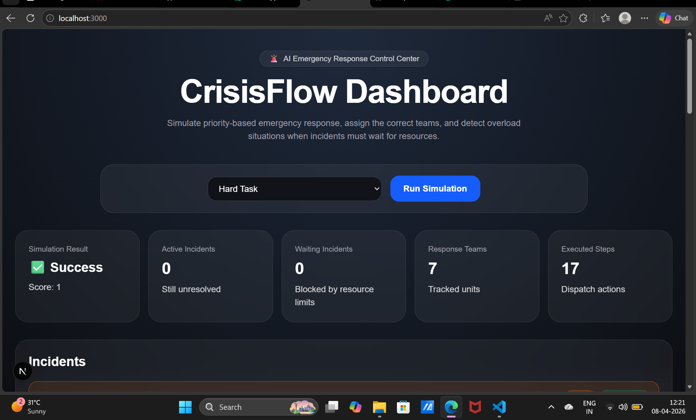
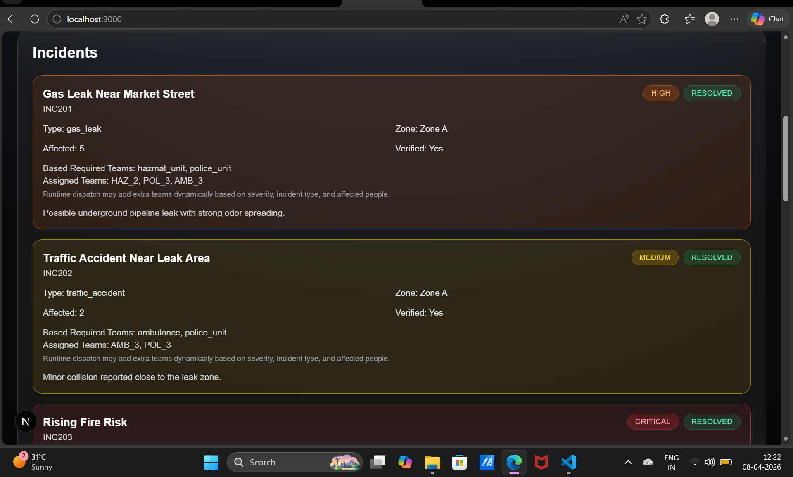
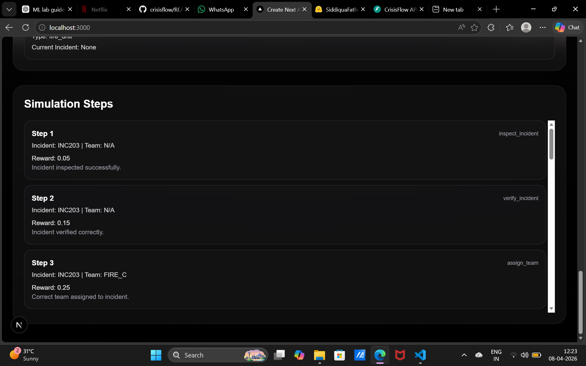
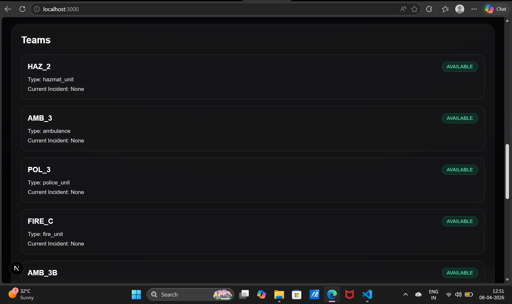
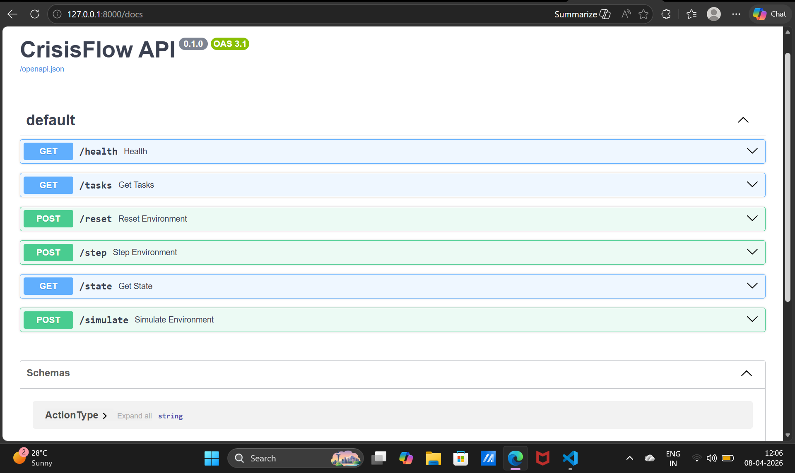

# 🚨 CrisisFlow – AI Emergency Response System

> 🚀 Phase 2 Validated | AI Decision System | Real-Time Crisis Simulation

CrisisFlow is an AI-powered emergency response simulation platform that intelligently prioritizes incidents, assigns response teams, and manages real-time crisis situations with explainable decision-making.
Designed specifically to align with OpenEnv evaluation and automated validation pipelines. 

---

## 🚀 Resubmission Notes

In this resubmission, I have significantly improved the robustness, structure, and evaluation-readiness of my CrisisFlow environment based on the feedback and troubleshooting guidelines.

### 🔧 Key Improvements
- Fixed Hugging Face deployment issues and ensured a stable running API with proper root (`/`) and health (`/health`) endpoints  
- Refined inference pipeline to produce **structured, validator-safe logs** with clear `[START]`, `[STEP]`, and `[END]` markers  
- Ensured **deterministic environment behavior** with consistent reward tracking across all tasks  
- Improved handling of complex scenarios like cascading incidents and resource overload  
- Integrated a **frontend dashboard** to visualize simulation steps, incident states, and team assignments  

---

## 🌍 Impact

CrisisFlow demonstrates how AI can assist in real-time emergency response by improving decision speed, optimizing resource allocation, and enabling scalable crisis management for smart cities and disaster response systems.
---

## ⚡ Core Capabilities

- 🚨 Priority-based incident handling (Low → Critical)
- 🤖 AI-driven decision engine with step-by-step reasoning
- 📊 Real-time simulation dashboard
- 🧩 Multi-incident handling (parallel crisis management)
- ⚡ Resource allocation & overload detection
- 🔍 Explainable AI (each step shows action + reward)

---

## 🌐 Live Demo

👉 Hugging Face Space:  
https://huggingface.co/spaces/SiddiquaFathima/crisisflow

---

## 🖥️ Frontend Dashboard

CrisisFlow provides a fully interactive dashboard to visualize emergency handling, decision-making, and resource allocation in real time.

### 🏠 Main Dashboard

---

### 🚨 Incident Management

---

### 🧠 AI Decision Steps (Explainability)

---

### 👥 Response Teams

---

## 🔌 API Documentation

FastAPI automatically generates interactive API docs.

👉 Open:https://siddiquafathima-crisisflow.hf.space/docs

---

## 🤖 Hugging Face Deployment

---

## ⚙️ Inference Output

.png)
.png)
---

## 🏗️ System Architecture

- **Frontend:** Next.js + TailwindCSS  
- **Backend:** FastAPI (Python)  
- **AI Engine:** Rule-based + reward-driven decision system  
- **Deployment:** Hugging Face Spaces  

---

## 🎬 Demo Flow

1. Incident is received  
2. AI inspects and verifies  
3. Assigns appropriate response teams  
4. Adapts dynamically based on system state  
5. Produces structured logs for evaluation

---

## 🧠 Intelligent Prioritization

CrisisFlow dynamically calculates a priority score based on:
- Severity level
- Number of affected people
- Incident urgency

This ensures critical incidents are handled first in multi-crisis scenarios.

---

## 🔄 Adaptive Decision System

The system adapts in real-time:
- If resources are unavailable → switches to waiting strategy  
- If escalation required → triggers escalation logic  
- Prevents redundant actions using state awareness  

---

## 🏆 Why CrisisFlow Stands Out

- Simulates real-world emergency response workflows
- Handles multiple concurrent incidents intelligently
- Provides explainable AI decisions (step-by-step logs)
- Fully compatible with OpenEnv evaluation framework
- Robust to failures with safe fallback mechanisms  

---

## 📌 Future Improvements

- 🗺️ Live map integration  
- 🔔 Real-time alerts & notifications  
- 📈 ML-based prediction for crisis escalation  
- 🔗 Integration with real emergency APIs  

---

## 🙌 Author

**Siddiqua Fathima**  
GitHub: https://github.com/siddiquafathima
