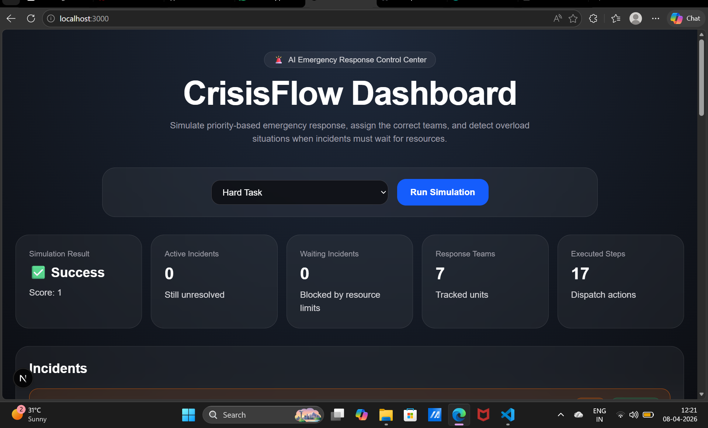

# 🚨 CrisisFlow – AI-Powered Emergency Response Management System


CrisisFlow is an AI-powered emergency response management system that simulates disaster response scenarios by intelligently prioritizing incidents, allocating emergency teams, and tracking response workflows.

The project demonstrates AI-assisted decision making, backend API development, frontend visualization, structured inference pipelines, and real-time emergency response simulation.

---

# 🚀 Live Demo

### 🌐 Hugging Face Space
https://huggingface.co/spaces/SiddiquaFathima/crisisflow

### 💻 GitHub Repository
https://github.com/siddiquafathima/crisisflow

---

# 📌 Project Overview

Emergency response requires quick, accurate, and explainable decision-making. CrisisFlow provides an AI-assisted environment that helps emergency coordinators:

- Prioritize emergency incidents
- Allocate available response teams
- Track incident status
- Simulate disaster management workflows
- Visualize incident handling in real time

The project combines AI decision logic with a modern web interface and REST API.

---

# 🎯 Key Features

- 🚨 AI-assisted emergency response workflow
- 📋 Incident management dashboard
- 🚑 Intelligent emergency team allocation
- ⚡ Priority-based incident handling
- 📊 Explainable inference logs
- 🔄 Multi-incident simulation
- 🌐 REST API powered by FastAPI
- 💻 Interactive frontend using Next.js
- 📈 Real-time response tracking
- 🧩 Modular and extensible architecture

---

# 🏗️ System Architecture

```
                User
                  │
                  ▼
        Next.js Frontend (React)
                  │
                  ▼
          FastAPI REST API
                  │
                  ▼
          AI Inference Engine
                  │
                  ▼
     Incident Decision Logic
                  │
                  ▼
      Emergency Response Simulation
```

---

# 🛠️ Tech Stack

## Programming Languages

- Python
- JavaScript
- HTML
- CSS

## Backend

- FastAPI
- Uvicorn

## Frontend

- Next.js
- React
- Tailwind CSS

## AI / ML

- OpenAI Compatible APIs
- Prompt-based Decision Workflow
- Rule-based Inference Engine

## Deployment

- Hugging Face Spaces
- GitHub

## Tools

- Git
- GitHub
- VS Code

---

# 📂 Project Structure

```
crisisflow/
│
├── backend/
│   ├── main.py
│   ├── routes/
│   ├── models/
│   └── utils/
│
├── frontend/
│   ├── app/
│   ├── components/
│   └── public/
│
├── inference.py
├── requirements.txt
├── README.md
└── images/
```

---

# ⚙️ Installation

## Clone Repository

```bash
git clone https://github.com/siddiquafathima/crisisflow.git

cd crisisflow
```

---

## Create Virtual Environment

```bash
python -m venv .venv
```

Windows

```bash
.venv\Scripts\activate
```

Linux / Mac

```bash
source .venv/bin/activate
```

---

## Install Dependencies

```bash
pip install -r requirements.txt
```

---

## Run Backend

```bash
uvicorn backend.main:app --reload
```

---

## Run Frontend

```bash
cd frontend

npm install

npm run dev
```

---

## Run Inference

```bash
python inference.py
```

---

# 📡 API Documentation

After starting the backend, open:

```
http://127.0.0.1:8000/docs
```

FastAPI automatically generates interactive Swagger documentation for testing API endpoints.

---

# 🧠 AI Inference Workflow

The inference engine follows a structured emergency response workflow:

1. Inspect Incident
2. Verify Incident
3. Assign Response Team
4. Escalate Critical Emergencies (if required)
5. Mark Incident Resolved
6. Generate Explainable Logs

This workflow enables transparent and reproducible emergency decision-making.

---

# 📸 Project Screenshots

## Dashboard



---

## Incident Management


---

## FastAPI Documentation


---

## AI Inference Output


---

## Hugging Face Deployment


---

# 📈 Example Inference Output

```
[START] task=task_easy_apartment_fire

↓

Inspect Incident

↓

Verify Incident

↓

Assign Team

↓

Resolve Incident

↓

Success
```

The inference engine logs every decision step, making the workflow transparent and easy to analyze.

---

# 👩‍💻 My Contributions

This project was independently designed and developed by me.

Key contributions include:

- Designed the overall project architecture
- Developed the FastAPI backend
- Built the AI inference workflow
- Implemented emergency response decision logic
- Developed the Next.js frontend dashboard
- Integrated backend APIs with the frontend
- Deployed the project on Hugging Face Spaces
- Created comprehensive project documentation

---

# 🎯 Learning Outcomes

Through this project, I gained practical experience in:

- Full Stack Development
- FastAPI
- REST API Design
- AI Workflow Design
- Frontend Integration
- Deployment
- Git & GitHub
- Software Architecture
- Explainable AI Workflows

---

# 🚀 Future Enhancements

Potential future improvements include:

- Reinforcement Learning for dispatch optimization
- Real-time GIS mapping
- Multi-agent emergency coordination
- Live notification system
- Voice-assisted emergency reporting
- Analytics dashboard
- Historical incident analysis
- AI-powered risk prediction

---

# 🤝 Contributing

Contributions, suggestions, and improvements are welcome.

1. Fork the repository
2. Create a new branch
3. Commit your changes
4. Push the branch
5. Open a Pull Request

---

# 📄 License

This project is released under the MIT License.

---

# 👩‍💻 Author

**Siddiqua Fathima**

Master of Computer Applications (MCA)

AI | Machine Learning | Computer Vision | Full Stack Development

GitHub:
https://github.com/siddiquafathima

Hugging Face:
https://huggingface.co/SiddiquaFathima

---

⭐ If you found this project useful, consider giving it a Star on GitHub.
